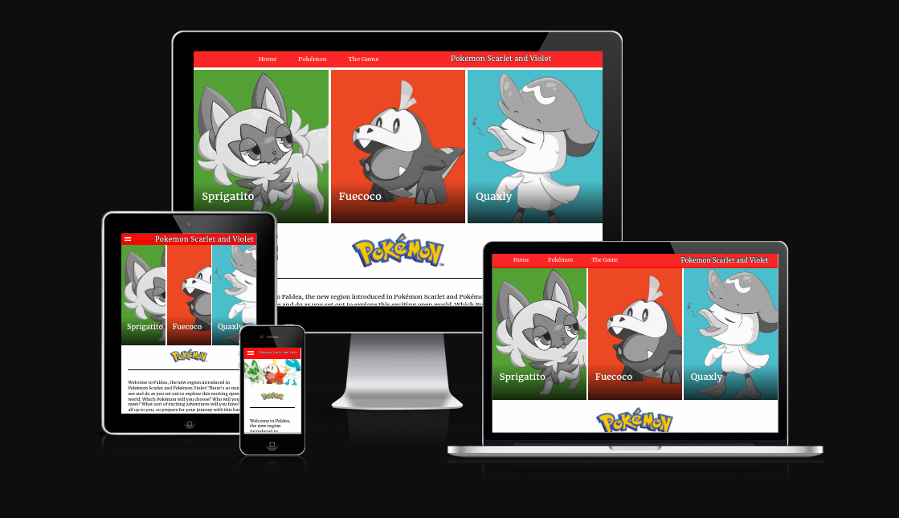
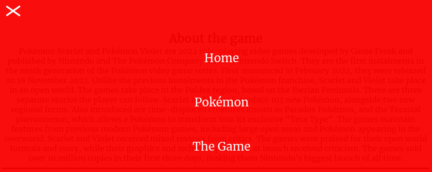

# Pokemon scarlet and violet

This website was created to inform about the three starter pokémons and their evolutions in Pokémon scarlet and violet, aswell as a little information about the games. 

The site contains of a home page with three sections, a Pokémon page with information about the pokemons and their evolutions, a game page with a little information about the game itself.
 
The target audience is pokémon enthusiasts from all over the world and in all ages.

This website is the first of five projects that needs to be completed in order to receive a diploma in Software Development from The Code Institute.

Requirements for the project is that the website has to be static and responsive using HTML5 and CSS3.

A live version of the project can be found here - https://haniibani.github.io/pokemon-scarlet/

# Table of Content

+ [UX](#ux "UX")
  + [User Demographic](#user-demographic "User Demographic")
  + [User Stories](#user-stories "User Stories")
    + [New Users](#new-users "New Users")
  + [User Goals](#user-goals "User Goals")
  + [Requirements](#requirements "Requirements")
  + [Design](#design "Design")
    + [Colors](#colors "Colors")
    + [Typography](#typography "Typography")
    + [Images](#images "Images")
+ [Features](#features "Features")
  + [Existing Features](#existing-features "Existing Features")
    + [Header With Logo and Navigation Bar Section](#header-with-logo-and-navigation-bar-section "Header With Logo and Navigation Bar Section")
    + [Home Page Hero Image Section](#home-page-hero-image-section "Home Page Hero Image Section")
    + [Home Section](#home-section "Home section")
    + [Pokemon Section](#pokemon-section "Pokemon Section")
    + [The Game Section](#the-game-section "The Game Section")
    + [Footer Section](#footer-section "Footer Section")
+ [Technologies used](#technologies-used "Technologies used")
+ [Testing](#testing "Testing")
  + [Validator Testing](#validator-testing "Validator Testing")
  + [Unfixed Bugs](#unfixed-bugs "Unfixed Bugs")
+ [Development and Deployment](#development-and-deployment "Development and Deployment")
+ [Content](#content "Content")
+ [Media](#media "Media")
+ [Credits](#credits "Credits")

## UX

### User Demographic

This website is ment for:

 - Pokémon fans from around the world who wants more information about the three starter pokémons in the game pokemon scarlet or violet.
 - People wanting to find more information about the game.

### User Stories

#### New Users

 - As a new User: I want to know what the different starters and their evolutions has to offer me.
 - As a new User: I want to feel whether the game is the right game for me.

### User Goals

 - Find information about Pokémon scarlet and Pokémon violet.
 - Find information about the starter pokemons.
 - Find information about what the evolutions of the starter pokémons are.
 - Find information about where to buy the game.
 - Watch the game trailer.

### Requirements

A static responsive website that incorporates the technologies I have learned so far that contains some advanced functionality. The development process needs to be well documented through a version controls system such as GitHub.

Required technologies: HTML, CSS

### Design

Since this is my very first HTML/CSS project, the design has been influenced by the ”Love Running” project aswell as browsing around the internet.

My goal for the website was to create a fun atmosphere were the user could get the standard "Pokémon" feeling yet still new and advanced in its functions. My wish was to create an interest in the game and a want to find out more.

Pokémon scarlet and violet website is a three page website divided into sections. Menu is fixed on top in order to ensure easy navigation between the pages. The navigation also takes a "hamburger" form from 900 pixels and down.

#### Colors

The colors were chosen after the original Pokémon colours, Red white and black. The hero colours are selected from the three starter pokemons original 
colors.

#### Typography

The [Google Font Merriweather](https://fonts.google.com/specimen/Merriweather?query=mont) was chosen as the main font with a fallback of Sans-Serif. Font weights of 300, 500 and 800 have been used on the website.

#### Images

Images have been chosen in accordance to the color and content. The purpose of the website is to awaken curiosity and express quality. Images have been sized in order to match design.

[Back to top](#Pokemon-scarlet-and-violet)

## Features 

Pokemon scarlet and violet website is a three-page website that consists of the following sections:

 - Header (Logo/Navigation Bar)
 - Home Page Hero Image
 - Home info
 - Where to buy the game
 - Game trailer
 - Footer
 - Sprigatitio and its evoloutions
 - Fuecoco and its evoloutions
 - Quaxly and its evoloutions
 - about the game
 - Paldea region

In order to make navigation easier between the pages, the navigation bar is fixed on top when the user scrolls up and down, aswell ass a "hamburger" navigation for 900px and down.

### Existing Features

#### Header With Logo and Navigation Bar Section

  - The Header consists of a header text "Pokemon Scarlet and Violet", that is aligned to the right and a Menu that is aligned to the left.
  - Featured on all four pages, the navigation bar includes links to the Home page, Classes page and Contact page and is identical in each page to allow for easy navigation.
  - The Header is at a fixed position on top and follows the user as the user scrolls down the page.

#### Home Page Hero Image Section

  - The Home Page Hero Image Section contains three hero images who change colour and size when hovering.
  - The Images also add information about the pokemon which is being hovered when hovered.
  - The section was built to give the user a welcome sensation and ignite curiosity.
  - The images gives a fun atmosphere with the hoveringeffect.

  - Hero without hoover:

  - Hero with hoover:

  - Hero 700px or down:

#### Home section

  - In the Home section the user will a short text about the game.
  - a Game trailer video.
  - The difference between the two games and where to buy them.
  - The purpose of the home section is to give users a little bit of an overview.

#### Pokemon Section

  - In the Pokemon section the user will find all the starter pokemons and its evolutions. With information about each specific pokemon. 
  - The purpose of the Pokemon section is to give users a feel of what the three different starter pokemons has to offer.

#### The Game Section

  - This section contains two sections and an image.
  - The purpose of this section is to give the user some extra information about the game and the region the game takes place in.

#### Footer Section

  - The Footer contains four social media links (Facebook, Instagram, Twitter and Youtube). 
  - The purpose of the Footer is to provide easy access for the user to the different social media platforms were Pokémon has a presence.

[Back to top](#pokemon-scarlet-and-violet)

## Technologies used

- [HTML](https://en.wikipedia.org/wiki/HTML)
- [CSS](https://en.wikipedia.org/wiki/CSS)

## Testing 

Test has been conducted using Google Chrome, Mozilla Firefox and Safari. Testing different devices and screen resolutions has been conducted using Google DevTools.

Listed is the main issues discovered.

1. Home page Hero-Images was not responsive enough for smaller screen sizes.
 - Solution: added a combined picture as a hero for smaller screens, as the hovering effect wont work on mobiles anyways i simply added a zoom effect.
2. The hero text would cover the navbar when scrolling down.
 - Solution: added z-index to make sure navbar was in front of hero.
3. Logo text not responsive enough for small screens.
 - Solution: Resized the font-size to a smaller size from 380px and down.
4. Pokemon page not responsive enough.
 - Solution: Added flexwrapping to make sure pictures got ahead of the text. Aswell as separating text by paragraph.
5. Menu not working properly on small screens and it gets cropped and divided.
 - Solution: Added a "hamburger" to smaller screen sizes.

Other than these issues i have come across minor issues while coding. Most of them are due to misspelled attributes, tags or similar mistakes.

### Validator Testing 

- HTML
  - No errors were returned when passing through the official [W3C Validator](https://validator.w3.org/nu/?doc=https%3A%2F%2F8000-haniibani-pokemonscarle-ldx1vcd6kzv.ws-eu84.gitpod.io%2Findex.html)

- CSS
  - No errors were returned when passing through the official [(Jigsaw validator)](https://jigsaw.w3.org/css-validator/validator?uri=https%3A%2F%2F8000-haniibani-pokemonscarle-ldx1vcd6kzv.ws-eu84.gitpod.io%2Findex.html&profile=css3svg&usermedium=all&warning=1&vextwarning=&lang=en)

### Unfixed Bugs

- All the bugs were fixed and moved to the section Testing.

 [Back to top](#pokemon-scarlet-and-violet)

## Development and Deployment

Gitpod was used as the development environment for this project. In order to track development stage and version control regular commits and pushes to GitHub has been made. The GitPod environment was created using a template provided by Code Institute.

The live version of the project is deployed at GitHub pages.

The procedure for deployment followed the "Creating your site" steps provided in [GitHub Docs.](https://docs.github.com/en/pages/getting-started-with-github-pages/creating-a-github-pages-site)

1. Log into GitHub.
2. Locate the GitHub Repository that shall be deployed live.
3. At the top of the repository, select Settings from the menu items.
4. Scroll down the Settings page to the ”GitHub Pages" section and click on the ”Check it out here!”
5. At the ”Source” section choose ”main” as Branch and root as folder and click ”Save”
6. The website will deploy and the pages refreshes to provide the live link to the project.

The live link can be found here - https://haniibani.github.io/pokemon-scarlet/the-game.html

## Content 

- All text content on this site has been taken from these sites:
  - https://scarletviolet.pokemon.com/
  - https://www.nintendolife.com/guides/pokemon-scarlet-and-violet-best-starter-pokemon-all-starter-evolutions#sprigatito-the-grass-cat-pokemon
  - https://bulbagarden.net/
- The design of the project is inspired by Code Institutes ”Love Running” project. Code has been borrowed from that project, the Footer.
- The icons in the footer were taken from: [Font Awesome](https://fontawesome.com/)

## Media

- All images were downloaded from [DeviantArt](https://www.deviantart.com/) and their free libraries.

## Credits 

### For code inspiration, design inputs, help and advice. Many thanks to:

Martina Terlevic
 - My amazing mentor at code institute, Thank you for the help!!
 

### Great sources

Sites that have provided me with knowledge and information that has been vital to this project:

- https://www.w3schools.com/
- https://stackoverflow.com/
- https://www.developerdrive.com/
- https://www.codesdope.com/
- https://fontawesome.com/
- https://www.javatpoint.com/

And all the content in HTML-Essentials, CSS-Essentials and the Walkthrough project ”Love Running” that has provided inspiration and knowledge.

all screenshots in this ReadMe was made using [Shutter](https://shutter-project.org)

[Back to top](#pokemon-scarlet-and-violet)